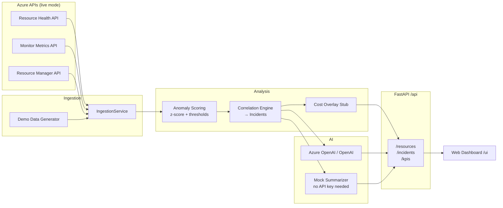

# AzurePilot 🚀

> **AI-powered Azure monitoring copilot** — combines Resource Health + Monitor Metrics to detect risky resources, explain root cause, and recommend next actions with cost-impact overlay.

[](https://www.python.org/)
[](https://fastapi.tiangolo.com/)
[](LICENSE)

---

## Why AzurePilot?

Cloud/SRE engineers currently juggle **separate dashboards** for Resource Health and Azure Monitor Metrics. The result:

- Alert fatigue from uncorrelated signals
- 30–90 minute triage cycles per incident
- No automatic dollar-cost framing for incidents
- Junior engineers need senior guidance to interpret raw metric anomalies

**AzurePilot** solves this by automatically:
1. Correlating health + metric signals into a single prioritised incident list
2. Generating an AI-powered root cause hypothesis (platform vs workload issue)
3. Recommending concrete next actions
4. Estimating the dollar cost of each unresolved incident

---

## Quick Start (< 5 minutes, no Azure account required)

```bash
# 1. Clone and enter the repo
git clone https://github.com/vinoth-kanagaraj-14883/azurepilot.git
cd azurepilot

# 2. Create virtual environment and install dependencies
python -m venv .venv
source .venv/bin/activate    # Windows: .venv\Scripts\activate
pip install -r requirements.txt

# 3. Start the API (demo mode — no credentials needed)
python -m uvicorn api.main:app --port 8000

# 4. Open the UI  (in a second terminal)
python -m http.server 3000 --directory ui
# Visit: http://localhost:3000
```

Or with Docker Compose:
```bash
docker-compose up --build
# UI: http://localhost:3000
# API: http://localhost:8000
# Docs: http://localhost:8000/docs
```

---

## Run Against a Real Azure Subscription

> Demo mode is always the default (zero credentials needed).  
> Follow these steps only when you want live data from your own Azure subscription.

**Required RBAC roles** — assign to the identity running AzurePilot:

| Role | Scope | Purpose |
|---|---|---|
| `Reader` | Subscription | List resources via Resource Manager |
| `Monitoring Reader` | Subscription | Read Azure Monitor metrics |
| `Resource Health Reader` | Subscription | Read availability statuses |

See [docs/setup.md](docs/setup.md) for full detail: service principal creation, managed identity setup, and troubleshooting.

```bash
# 1. Authenticate (simplest option for local testing)
az login
az account set --subscription <your-subscription-id>

# 2. Configure .env for live mode
cp .env.example .env
# then edit .env and set:
#   AZUREPILOT_MODE=live
#   AZURE_SUBSCRIPTION_ID=<your-subscription-id>
#   AZURE_RESOURCE_GROUP=<optional — scope to one RG, or leave blank for whole subscription>

# 3. (Recommended) Verify your credentials and permissions before running the full app
python scripts/verify_azure_connection.py

# 4. Run exactly like demo mode
python -m uvicorn api.main:app --port 8000
python -m http.server 3000 --directory ui
# Visit: http://localhost:3000
```

---

## Architecture



---

## Features

| Feature | Status |
|---|---|
| Virtual Machine monitoring | ✅ |
| App Service monitoring | ✅ |
| Storage Account monitoring | ✅ |
| Resource Health correlation | ✅ |
| Metric anomaly scoring (z-score) | ✅ |
| AI incident summary (mock) | ✅ |
| AI root cause hypothesis | ✅ |
| AI recommended actions | ✅ |
| Cost impact overlay (stub) | ✅ |
| Demo mode (no credentials) | ✅ |
| Azure OpenAI integration | ✅ |
| OpenAI fallback | ✅ |
| REST API with OpenAPI docs | ✅ |
| Web dashboard | ✅ |
| Docker Compose | ✅ |
| Unit tests | ✅ |

---

## API Reference

The API auto-generates OpenAPI docs at **http://localhost:8000/docs**.

| Endpoint | Description |
|---|---|
| `GET /resources` | All monitored resources with risk score + health status |
| `GET /incidents` | Active incidents sorted by risk score |
| `GET /incidents/{id}` | Full incident detail: AI summary, root cause, recommendations, cost |
| `GET /kpis` | KPI summary (incidents, avg risk, cost impact) |
| `POST /refresh` | Manually trigger a full pipeline re-run |
| `GET /health` | Health/readiness check |

---

## Supported Resource Types

- **Microsoft.Compute/virtualMachines** — CPU, Memory, Network, Disk
- **Microsoft.Web/sites** — CPU, HTTP errors, Queue length, Response time
- **Microsoft.Storage/storageAccounts** — Availability, Latency, Transactions

---

## Running Tests

```bash
# Install dependencies (if not already done)
pip install -r requirements.txt

# Run all tests
pytest

# Run with verbose output
pytest -v

# Run a specific module
pytest tests/test_anomaly.py -v
pytest tests/test_correlation.py -v
pytest tests/test_api.py -v
```

---

## Project Structure

```
azurepilot/
├── ingestion/          Azure API clients + demo data generator
│   ├── models.py       Shared Pydantic data models
│   ├── config.py       Settings (pydantic-settings)
│   ├── health_client.py    Resource Health API client
│   ├── metrics_client.py   Monitor Metrics API client
│   ├── resource_discovery.py  Resource Manager list API
│   ├── demo_data.py    Synthetic demo data (VM, App Service, Storage)
│   └── service.py      IngestionService orchestrator
├── analysis/           Anomaly scoring + correlation engine
│   ├── anomaly.py      Baseline, z-score, 0-100 risk scoring
│   ├── correlation.py  Incident correlation engine
│   ├── cost_overlay.py Cost impact stub (real API wire-up documented)
│   └── service.py      AnalysisService orchestrator
├── ai/                 LLM prompt templates + service wrapper
│   ├── prompts.py      Prompt templates (summary, root cause, action)
│   ├── mock_summarizer.py  Template-based fallback (no API key)
│   └── service.py      AIService (Azure OpenAI / OpenAI / mock)
├── api/                FastAPI REST API
│   ├── main.py         App + endpoints
│   ├── pipeline.py     Full pipeline runner
│   ├── state.py        In-memory state store
│   └── schemas.py      Response models
├── ui/
│   └── index.html      Single-page dashboard (vanilla JS)
├── docs/
│   ├── architecture.md Component diagram + data flow
│   ├── setup.md        Local + Azure setup guide
│   ├── demo-script.md  Leadership demo walkthrough
│   └── prompt-templates.md  LLM prompt docs + tuning guide
├── tests/
│   ├── test_anomaly.py     Anomaly scoring unit tests
│   ├── test_correlation.py Correlation engine unit tests
│   └── test_api.py         API endpoint integration tests
├── .env.example        All configuration options
├── requirements.txt
├── docker-compose.yml
├── Dockerfile
└── README.md
```

---

## Configuration

Copy `.env.example` to `.env` and configure:

```bash
cp .env.example .env
```

Key variables:

| Variable | Default | Description |
|---|---|---|
| `AZUREPILOT_MODE` | `demo` | `demo` = offline, `live` = real Azure |
| `AZURE_SUBSCRIPTION_ID` | — | Required for live mode |
| `AZURE_OPENAI_ENDPOINT` | — | Optional: Azure OpenAI endpoint |
| `AZURE_OPENAI_API_KEY` | — | Optional: Azure OpenAI key |

See [docs/setup.md](docs/setup.md) for the full configuration reference and Azure RBAC setup.

---

## KPIs — Proving ROI

Track these from day one:

- **MTTR reduction** — engineers get root cause immediately vs 30-90 min triage
- **Alert fatigue reduction** — N metric alerts → 1 prioritised incident
- **Incidents prevented** — proactive risk score catches issues before customers see them
- **Cost savings** — dollar-framed incidents make business case visible
- **Engineer hours saved** — estimated 2-4 hours per major incident

---

## Roadmap

- [ ] Azure SQL Database + AKS monitoring
- [ ] Wire cost overlay to real Azure Cost Management API
- [ ] Background polling (APScheduler / Azure Functions)
- [ ] Teams/Slack/PagerDuty notifications
- [ ] Persistent state (Cosmos DB / Redis)
- [ ] Metric time-series charts in the UI
- [ ] Multi-subscription support

---

## Docs

- [Architecture](docs/architecture.md)
- [Setup Guide](docs/setup.md)
- [Demo Script](docs/demo-script.md)
- [Prompt Templates](docs/prompt-templates.md)
