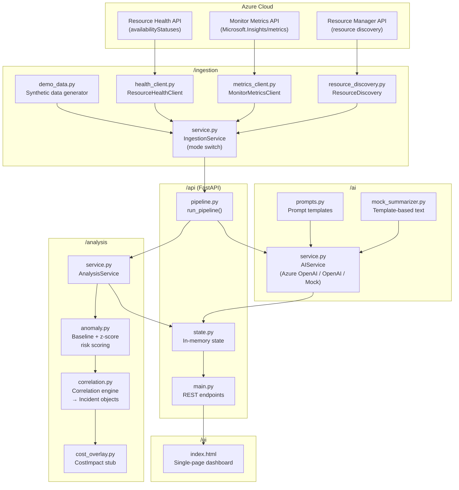

# AzurePilot — Architecture

## Overview

AzurePilot is a single-repo Python (FastAPI) + HTML/JS prototype that
correlates **Azure Resource Health** signals with **Azure Monitor Metrics**
to produce a prioritised incident list with AI-generated root cause analysis
and recommendations.

---

## Component Diagram



---

## Data Flow

```
1. STARTUP / REFRESH
   IngestionService.get_resources()      → list[AzureResource]
   IngestionService.get_health_events()  → list[HealthEvent]
   IngestionService.get_metrics_for_resource() → dict[resource_id, list[MetricSeries]]

2. ANALYSIS
   anomaly.compute_resource_risk()       → ResourceRiskProfile (risk_score 0-100)
   correlation.correlate()               → list[Incident]
   cost_overlay.estimate_cost_impact()   → CostImpact (stub)

3. AI ENRICHMENT
   AIService.enrich_incident()           → Incident with summary / root_cause / recommendation

4. API
   GET /incidents  → list of Incident (sorted by risk_score desc)
   GET /incidents/{id} → full Incident detail
   GET /resources  → all resources with risk score overlay
   GET /kpis       → summary KPIs

5. UI
   Polls /incidents, /kpis on load and after manual refresh
   Click → GET /incidents/{id} → renders detail panel
```

---

## Key Design Decisions

| Decision | Choice | Rationale |
|---|---|---|
| Language | Python 3.11 | Strong Azure SDK support, FastAPI ecosystem |
| API framework | FastAPI | Auto OpenAPI docs, async-ready, Pydantic validation |
| Azure auth | DefaultAzureCredential | Supports MI, SP, CLI transparently |
| Anomaly scoring | Z-score + threshold rules | Simple, explainable, no ML infra required |
| LLM provider | Azure OpenAI → OpenAI → mock | Prioritises Azure-native; works offline |
| UI | Plain HTML/JS + Chart.js | No build step, zero dependencies, easy to run |
| State | In-memory AppState | Sufficient for prototype; replace with Redis/DB in prod |

---

## Module Responsibilities

### `/ingestion`
- `models.py` — shared Pydantic data models (`AzureResource`, `HealthEvent`, `MetricSeries`, ...)
- `config.py` — settings loaded from environment via pydantic-settings
- `health_client.py` — Azure Resource Health REST client (API version: 2022-10-01)
- `metrics_client.py` — Azure Monitor Metrics REST client (API version: 2023-10-01)
- `resource_discovery.py` — list resources of supported types in a subscription/RG
- `demo_data.py` — synthetic data generator for offline/demo mode
- `service.py` — `IngestionService` orchestrator; switches between demo and live mode

### `/analysis`
- `anomaly.py` — baseline computation (rolling mean/stddev), z-score anomaly detection, 0-100 risk scoring
- `correlation.py` — `correlate()` function: merges health events + risk profiles → `Incident` objects
- `cost_overlay.py` — `estimate_cost_impact(incident)` stub (documents real API integration path)
- `service.py` — `AnalysisService` orchestrator

### `/ai`
- `prompts.py` — LLM prompt templates (summary, root cause, recommendation)
- `mock_summarizer.py` — deterministic template-based fallback (no API key needed)
- `service.py` — `AIService` with provider auto-detection

### `/api`
- `main.py` — FastAPI app with endpoints + CORS
- `pipeline.py` — `run_pipeline()`: ingestion → analysis → AI enrichment
- `state.py` — thread-safe in-memory state store
- `schemas.py` — Pydantic response models

### `/ui`
- `index.html` — single-page dashboard (vanilla JS, Chart.js via CDN)

---

## Future Iterations

- Replace in-memory state with Azure Cosmos DB or Redis
- Wire `cost_overlay.py` to Azure Cost Management API
- Add metric time-series charts in the UI
- Support Azure SQL Database and AKS clusters
- Add webhook / Teams / PagerDuty notification on new incidents
- Background polling loop (APScheduler or Azure Functions trigger)
